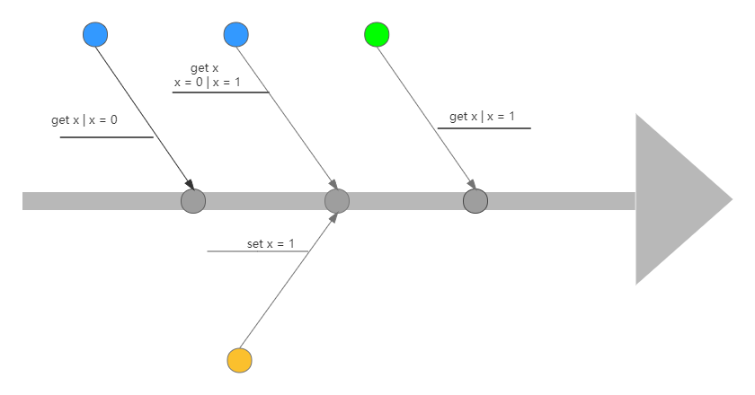

[TOC]
# Apache ZooKeeper 深入理解与实践

> [ZooKeeper Doc Overview](https://zookeeper.apache.org/doc/r3.8.0/zookeeperOver.html)

## 1. 应用场景
基于ZooKeeper的数据特性，一般主要用作以下几个场景，可参考官网提供的一些使用案例 [ZooKeeper：使用案例](https://zookeeper.apache.org/doc/r3.8.0/zookeeperUseCases.html)
- 注册中心
- 集群Leader选举
- 配置中心
- 分布式锁

## 2. 特性分析
### 2.1 节点状态信息
节点除了存储数据内容以外，还存储了数据节点本身的一些状态信息，通过`get`命令可以获得状态信息的详细内容。
| 状态属性       | 说明                                                         |
| -------------- | ------------------------------------------------------------ |
| czxid          | 即Created ZXID，表示该数据节点被创建时的事务ID               |
| mzxid          | 即Modified ZXID，表示该节点最后一次被更新的事务ID            |
| ctime          | 即Created Time，表示节点被创建的时间                         |
| mtime          | 即Modified Time，表示该节点最后一次被更新的时间              |
| version        | 数据节点的版本号                                             |
| cversion       | 子节点的版本号                                               |
| aversion       | 节点的ACL版本号                                              |
| ephemeralOwner | 创建该临时节点的会话的sessionID，如果该节点时持久节点，那么这个属性值为0 |
| dataLength     | 数据内容的长度                                               |
| numChildren    | 当前节点的子节点个数                                         |
| pzxid          | 表示该节点的子节点列表最后一次被修改时的事务ID<br>注意：只有子节点列表变更了才会变更pzxid，子节点内容变更不会影响pzxid |

### 2.2 版本
zookeeper为数据节点引入了版本的概念，每个数据节点都有三类版本信息，对数据节点任何更新操作都会引起版本号的变化
| 状态属性 | 说明             |
| -------- | ---------------- |
| version  | 数据节点的版本号 |
| cversion | 子节点的版本号   |
| aversion | 节点的ACL版本号  |

版本有点和我们经常使用的乐观锁类似：**乐观锁**，**悲观锁**

- 悲观锁：是数据库中一种非常典型且非常严格的并发控制策略。假如一个事务A正在对数据进行处理，那么在整个处理过程中，都会将数据处于锁定状态，在这期间其他事务无法对数据进行更新操作。
- 乐观锁：乐观锁和悲观锁正好相反，它假定多个事务在处理过程中不会彼此影响，因此在事务处理过程中不需要进行加锁处理，如果多个事务对同一数据做更改，那么在更新请求提交之前，每个事务都会首先检查当前事务读取数据后，是否有其他事务对数据进行了修改，如果有修改，则回滚事务

zookeeper中，version属性就是用来实现乐观锁机制的 **写入校验**

### 2.3 Watcher机制

ZooKeeper提供了分布式数据的发布/订阅功能，ZooKeeper允许客户端向服务端注册一个watcher监听，当服务端的一些指定事件触发了watcher，那么服务端就会向客户端发送一个事件通知。

以下命令中包含 [-w]参数的皆可被监听
```sh
[zk: localhost:2181(CONNECTED) 0] help
ZooKeeper -server host:port -client-configuration properties-file cmd args
	addWatch [-m mode] path # optional mode is one of [PERSISTENT, PERSISTENT_RECURSIVE] - default is PERSISTENT_RECURSIVE
	addauth scheme auth
	close 
	config [-c] [-w] [-s]
	connect host:port
	create [-s] [-e] [-c] [-t ttl] path [data] [acl]
	delete [-v version] path
	deleteall path [-b batch size]
	delquota [-n|-b|-N|-B] path
	get [-s] [-w] path
	getAcl [-s] path
	getAllChildrenNumber path
	getEphemerals path
	history 
	listquota path
	ls [-s] [-w] [-R] path
	printwatches on|off
	quit 
	reconfig [-s] [-v version] [[-file path] | [-members serverID=host:port1:port2;port3[,...]*]] | [-add serverId=host:port1:port2;port3[,...]]* [-remove serverId[,...]*]
	redo cmdno
	removewatches path [-c|-d|-a] [-l]
	set [-s] [-v version] path data
	setAcl [-s] [-v version] [-R] path acl
	setquota -n|-b|-N|-B val path
	stat [-w] path
	sync path
	version 
	whoami 
```

zookeeper提供一下几种命令来对自定义设置监听

1. `get [-s] [-w] path`

   > 监听指定path节点的修改和删除事件，该事件是一次性触发。

   ```sh
   [zk: localhost:2181(CONNECTED) 0] get -w /watcher
   1234
   
   # 在其他窗口或工具执行以下命令，可在监听窗口获取所触发的事件通知。
   set /watcher 123
   delete /watcher
   
   # 监听结果
   [zk: localhost:2181(CONNECTED) 1] 
   WATCHER::
   
   WatchedEvent state:SyncConnected type:NodeDataChanged path:/watcher
   ```

2. `ls [-s] [-w] [-R] path`

   > 监控指定path的子节点的添加和删除事件。

   ```sh
   [zk: localhost:2181(CONNECTED) 0] ls -w /node
   
   # 在其他窗口执行以下命令，会触发相关事件
   create /node/node1
   delete /node/node1
   ```

3. `stat [-w] path`

   > 作用与`get`完全相同

4. `addWatch [-m mode] path # optional mode is one of [PERSISTENT, PERSISTENT_RECURSIVE] - default is PERSISTENT_RECURSIVE`

   > addWatch的作用时针对指定节点添加事件监听，支持两种模式
   >
   > - PERSISTENT，持久化订阅，针对当前节点的修改和删除，以及当前节点的子节点的删除和新增事件。
   > - PERSISTENT_RECURSIVE，持久化递归订阅，在PERSISTENT的基础上，增加了子节点修改的事件触发，以及子节点的子节点的数据变化都将会触发相关事件（满足递归订阅特性）

### 2.4 Session会话机制
[ZooKeeper: Because Coordinating Distributed Systems is a Zoo (apache.org)](https://zookeeper.apache.org/doc/r3.8.0/zookeeperProgrammers.html#ch_zkSessions)

查看官网提供的图，表示ZooKeeper的Session会话状态机制

- 首先，客户端向ZooKeeper Server发起连接请求，此时状态为CONNECTING
- 当连接建立好之后，Session状态转化为CONNECTED，此时可以进行操作的IO操作
- 如果Client和Server的连接出现丢失，则Client又会变成CONNECTING状态
- 如果会话过期或者主动关闭连接时，此时连接状态为CLOSE
- 如果是身份验证失败，直接结束

### 2.5 ZooKeeper权限控制
> ZooKeeper作为一个分布式协调框架，内部存储了一些分布式系统运行时状态的数据，比如master选举、分布式锁。对这些数据的操作会直接影响到分布式系统的运行状态。因此，为了保证ZooKeeper中的数据安全性，避免误操作带来的影响，ZooKeeper提供了一套ACL权限控制机制来保证数据的安全性。

ACL权限控制，使用 `scheme:id:perm` 来标识。

- scheme：权限模式，标识授权策略
- ID：授权对象
- Permission：授予的权限

ZooKeeper的权限控制是基于每个znode节点的，需要对每个节点设置权限，每个znode支持设置多种权限控制方案和权限，子节点不会继承父节点的权限，但可能访问它的子节点。

#### 2.5.1 Scheme权限模式

ZooKeeper提供以下权限模式，所谓权限模式，即使用什么样的方式来进行授权。

- world：默认方式，相当于全部都能访问
- auth：代表已经认证通过的用户（cli中可以通过`addauth digest user:pwd`来添加当前上下文中的授权用户）
- digest：即用户名：密码这种方式认证，也就是业务系统中最常用的。用*username:password*字符串来产生一个MD5串，然后该串被用来作为ACL ID。认证是通过铭文发送*username:password*来进行的，当用在ACL时，表达式为*username:base64*，base64时password的SHA1摘要的编码。
- ip：通过IP地址来做权限控制，比如*ip:192.168.1.1*，表示权限控制都是针对这个IP地址的，也可以针对网段*ip:192.168.1.1/24*，此时addr中的有效位与客户端addr中的有效位进行比对。

#### 2.5.2 ID授权对象

指权限赋予的用户或者一个指定的实体，不同的权限模式下，授权对象不同

| 权限模式 | 授权对象                                                     |
| -------- | ------------------------------------------------------------ |
| IP       | 通常时一个IP地址或IP段，例：“192.168.1.110”或 “192.168.0.1/24” |
| Digest   | 自定义，通常是”username:BASE64(SHA-1(username:password))“，例：”foo:kWn**“ |
| World    | 只有一个ID：“anyone”                                         |
| Super    | 与Digest模式一致                                             |

```java
Id ipId1 = new Id("ip", "192.168.0.1");
Id ANYONE_ID_UNSAFE = new Id("world", "anyone")
```

#### 2.5.3 Permission权限模式

> 指通过权限检查后，可以被允许的操作：create/delete/read/write/admin
>
> - Create：允许对子节点Create操作
> - Read：允许对本节点GetChildren和GetData操作
> - Write：允许对本节点SetData操作
> - Delete：允许对子节点Delete操作
> - Admin：允许对本节点SetAcl操作

权限模式（Schema）和授权对象主要用来确认权限验证过程中使用的验证策略：比如IP地址、digest:username:password，匹配到验证策略，并验证成功后，再根据权限操作类型来决定当前客户端的访问权限。

#### 2.5.4 控制台权限操作

在ZooKeeper中提供了ACL相关的命令，如下：

```sh
# 读取ACL权限
getAcl getAcl <path> 
# 设置ACL权限
setAcl setAcl <path> <acl>
# 添加认证用户
addauth addauth <shceme> <auth>
```

##### 2.5.4.1 world方式

创建一个节点后，默认就是world模式

```sh
[zk: localhost:2181(CONNECTED) 0] create /auth
Created /auth
[zk: localhost:2181(CONNECTED) 1] getAcl /auth
'world,'anyone
: cdrwa
[zk: localhost:2181(CONNECTED) 2] create /world
Created /world
[zk: localhost:2181(CONNECTED) 3] getAcl /world
'world,'anyone
: cdrwa
[zk: localhost:2181(CONNECTED) 4] setAcl /world world:anyone:acd
[zk: localhost:2181(CONNECTED) 5] getAcl /world 
'world,'anyone
: cda
```

其中，cdrwa 分别对应 create delete read write admin

##### 2.5.4.2 IP模式

在IP模式中，首先连接到zkServer的命令需要使用如下方式

```sh
./zkCli.sh -server 192.168.3.198:2181
```

按照IP的方式操作如下

```sh
[zk: 192.168.3.198:2181(CONNECTED) 0] create /ip-model
Created /ip-model
[zk: 192.168.3.198:2181(CONNECTED) 1] setAcl /ip-model ip:127.0.0.1:cdrwa,ip:192.168.3.7:cdr
# 命令中未添加Docker IP
[zk: 192.168.3.198:2181(CONNECTED) 2] getAcl /ip-model
Insufficient permission : /ip-model
[zk: 192.168.3.198:2181(CONNECTED) 3] 
# 当前登录，使用 ./zkCli.sh 连接
[zk: localhost:2181(CONNECTED) 0] getAcl /ip-model
'ip,'127.0.0.1
: cdrwa
'ip,'192.168.3.7
: cdr
```

##### 2.5.4.3 Auth模式

auth模式的操作如下

```sh
[zk: localhost:2181(CONNECTED) 0] create /auth
Created /auth
[zk: localhost:2181(CONNECTED) 1] addauth digest yanzz:yanzz
[zk: localhost:2181(CONNECTED) 2] setAcl /auth auth:yanzz:cdrwa
[zk: localhost:2181(CONNECTED) 3] getAcl /auth
'digest,'yanzz:p2DF6FeyYPiJ9llrzwjgC0gnBp4=
: cdrwa
```

当退出当前会话后，再次连接，执行如下操作，会提示没有权限

```sh
[zk: localhost:2181(CONNECTED) 0] get /auth
Insufficient permission : /auth
```

重新授权

```sh
[zk: localhost:2181(CONNECTED) 1] addauth digest yanzz:yanzz
[zk: localhost:2181(CONNECTED) 2] get /auth
null
```

##### 2.5.4.4 Digest

使用语法，会发现使用方式和Auth相同。

```sh
setAcl /digest digest:username:password:permission
```

但是有一个不一样的点，密码需要使用加密后的，否则无法被识别。

密码：用户名和密码加密后的字符串

使用下面程序生成密码

```java
public static void main(String[] args) throws NoSuchAlgorithmException {
    String up = "yanzz:yanzz";
    byte[] digest = MessageDigest.getInstance("SHA1").digest(up.getBytes(StandardCharsets.UTF_8));
    String encodeStr = Base64.getEncoder().encodeToString(digest);
    System.out.println(encodeStr);
}
```

得到字符串：p2DF6FeyYPiJ9llrzwjgC0gnBp4=

在zkCli上进行如下操作

```sh
[zk: localhost:2181(CONNECTED) 0] create /digest
Created /digest
[zk: localhost:2181(CONNECTED) 1] setAcl /digest digest:yanzz:p2DF6FeyYPiJ9llrzwjgC0gnBp4=:cdrwa
# 未添加授权时访问 /digest 节点
[zk: localhost:2181(CONNECTED) 2] getAcl /digest
Insufficient permission : /digest
# 添加授权信息
[zk: localhost:2181(CONNECTED) 3] addauth digest yanzz:yanzz
[zk: localhost:2181(CONNECTED) 4] getAcl /digest
'digest,'yanzz:p2DF6FeyYPiJ9llrzwjgC0gnBp4=
: cdrwa
```

## 3. ZooKeeper设计探索

### 3.1 保证

> ZooKeeper提供以下几种服务保证

- **顺序一致性** - 来自客户端的更新将按发送顺序应用。

- **原子性** - 更新要么成功，要么失败。无部分结果。

- **单个系统映像** - 客户端将看到相同的服务视图，而不管它连接到哪个服务器。

- **可靠性** - 应用更新后，它将从那时起一直存在，直到客户端覆盖更新。

- **及时性** - 保证系统的客户端视图在特定时间范围内是最新的。

### 3.2 简单接口

> ZooKeeper提供的原生简单的API，简单来说即：增删改查，获取子节点及数据同步。

- *create* 

- *delete* 

- *exists* 

- *get data* 

- *set* *data*

- *get* *children*

- *sync* 

### 3.3 分布式设计

> 一般的中间件进行分布式设计考虑时，一般在集群设计时，一般即包括：
>
> - 主从节点
> - 数据同步
> - 主节点选举

#### 3.3.1 ZooKeeper设计

> ZooKeeper设计时，在集群考虑上，划分了三个角色
>
> - Leader角色
> - Follower角色
> - Observer角色

##### 3.3.1.1 Leader角色

主要职责：

- 事务请求的唯一调度和处理者，保证集群事务处理的顺序性

- 集群内部各服务器的调度者

##### 3.3.1.2 Follower角色

主要职责：

- 处理客户端非事务请求、转发事务请求给Leader服务器

- 参与事务请求Proposal的投票（半数以上即可通过）

- 参与Leader选举的投票

##### 3.3.1.3 Observer角色

> @since 3.3 开始引入的一个全新的服务器角色

工作原理与Follower角色基本一致，唯一的差别即不参与任何形式的投票。简单来说，Observer服务器只提供非事务请求服务，通常在于不影响集群事务处理能力的前提下提升集群的非事务处理的能力。

#### 3.3.2 集群中数据同步

如下图，假如现有5台服务器集群，其中1台Leader服务器，其余4台Follower服务器，不考虑Observer服务器

那么客户端发起一个**事务请求**，假如请求是发送到其中一台Follower服务器，那么整个请求就会经过下图所示的1-6的数据流转流程。

1. 客户端请求发起请求
2. Follower服务器转发事务请求至Leader服务器
3. Leader服务器处理完事务请求之后，发起集群数据同步，并发起事务投票
4. Follower服务器处理数据同步，并返回投票结果（无放弃投票概念）
5. Leader收到过半投票结果即会发起事务提交
6. 数据执行完整之后返回客户端请求结果


注：

1. 查询和维护管理命令只包括 1 和 6， 即不会和Leader打交道，响应是即刻响应

2. create，setData，setAcl，delete，createSession，closeSession等命令是需要经过上图的六个处理过程

3. client与follower之间的通信是采用NIO，Leader与Follower之间是采用TCP/IP模式

#### 3.3.3 分布式事务数据一致性协议

##### 3.3.3.1 2PC协议

> 二阶段提交的算法思路可以概括为：参与者将操作成败通知协调者，再由协调者根据所有参与者的反馈情报决定各参与者是否要提交操作还是中止操作。


##### 3.3.3.2 ZooKeeper集群组成

在讨论ZooKeeper数据一致性前，先看一下ZooKeeper的集群分布。

在ZooKeeper集群中，一般以2n+1台实例作为集群。

入下图所示，Leader节点会发起数据同步至Follower节点及Observer节点，发起选举投票至Follwer节点，客户端连接集群时随机连接至某一集群节点。


##### 3.3.3.3 ZooKeeper中的一致性

在ZooKeeper的设计时，ZooKeeper保证的是数据的强顺序一致性，概念不太容易理解，可以这么解释：

如下图所示，在客户端发起事务请求至Leader节点，Leader处理之后，同步至Follower节点；

当客户端请求至其中一个Follower节点，查询数据时，若此时Follower节点已同步完成副本，那么此时获取的值，即事务处理完整之后的值，此时获取不到变更前的值，理解为顺序一致性。


如果时间粒度变大，以一个节点为例，如果事务请求与查询请求几乎在同一时间点，那么在获取值的时候，这么值可能是旧值，也可能是新值，取决于此时事务请求是否已经处理，事务请求未处理，那么此时获取到的仍是旧值，事务请求处理完成之后，那么此时获取的值就是新值。



CAP理论中，ZooKeeper保证的是最终一致性，结合这两块内容可以理解ZooKeeper在数据一致性上解释为强的顺序一致性。


### 3.4 崩溃恢复

> 该章节内容围绕以下问题展开讨论
>
> - Leader节点如何选举？
>
> - Leader节点崩溃后，整个集群无法处理写请求，如何快速选出新的Leader？
>
> - Leader节点和各个Follower节点的数据一致性如何保证？

#### 3.4.1 ZAB协议

ZAB（ZooKeeper Atomic Broadcast）协议是为分布式协调服务ZooKeeper专门设计的一种支持崩溃恢复的原子广播协议。

在ZooKeeper中，主要依赖ZAB协议来实现分布式数据一致性，基于该协议，ZK实现了一种主备模式的系统架构来保持集群各个副本之间的数据一致性。

ZAB协议包含两种基本模式：

- 崩溃恢复

- 原子广播

当整个集群在启动时，或当Leader节点出现网络中断、崩溃等情况时，ZAB协议就进入恢复模式，并选举产生新的Leader。

Leader选举出来，集群中过半的机器与该Leader节点完成数据同步后，ZAB协议就退出恢复模式。


当集群中已经有过半的Follower节点完成了和Leader状态同步以后，那么整个集群就进入了消息广播模式。

在Leader节点正常工作时，启动一台新的服务器加入集群，那么这个服务器就会直接进入数据恢复模式，和Leader节点进行数据同步。

#### 3.4.2 消息广播

消息广播，实际上是一个简化版本的二阶段提交过程

1. Leader受到消息请求后，将消息赋予一个全局唯一64位自增ID，即：zxid，通过zxid大小比较即可实现因果有序这个特征

2. Leader为每个Follower准备了一个FIFO队列（TCP协议实现，以实现全局有序这一特点）将带有zxid的消息作为一个提案（proposal）分发给所有的Follower

3. 当Follower接受到proposal，先将proposal写入磁盘，成功后再回复ACK

4. 当Leader收到合法数量（超过半数节点）的ACK后，Leader就向这些Follower发送Commit命令，同时会在本地执行此消息

5. 当Follower收到消息的Commit命令以后，会提交该消息


和完整2PC事务不一样的地方在于，

- ZAB协议不能终止事务，Follower节点要么ACK给Leader要么抛弃Leader

- 只需要保证过半数节点响应这个消息并提交了即可

虽然在某一时刻Follower节点和Leader节点的状态会不一致，但是也是这个特性提升了集群的整体性能，当然这种数据不一致的问题，ZAB协议提供了一种恢复模式来进行数据恢复。

Leader的投票过程，不需要Observer的ACK，但是Observer必须要同步Leader的数据，从而在处理请求的时候保证数据的一致性。

#### 3.4.3 崩溃恢复

ZAB协议的这个基于原子广播协议的消息广播过程，正常情况下，没有任何问题，但一旦Leader节点崩溃，或者由于网络问题导致Leader服务器失去了过半的Follower节点的联系（可能是Leader节点和Follower节点之间产生了网络分区，那么此时Leader不再是合法的Leader），那么就会进入崩溃恢复模式。

崩溃恢复模式需要做两件事：

- 选举出新的Leader

- 数据同步

在集群崩溃恢复时，需要保证以下两点

- 已被处理的消息不能丢弃

- 被丢弃的消息不能再次出现

例：先后广播了消息P1, P2, C1, P3, C2

当Leader把消息C2消息发出后就立即崩溃退出，那么这种情况，ZAB协议就需要保证所有服务器上都提交成功，否则将会出现不一致；

之前挂了的Leader重新启动并注册成了Follower，它保留了被跳过的消息的Proposal状态，与整个系统是不一致的，需要将其删除。

#### 3.4.4 选举

##### 3.4.4.1 ZXID

为了保证事务的顺序一致性，采用了递增的事务ID（zxid）来标识事务，所有的提议，都是在被提出的时候加上了zxid；

实现中，ZXID是一个64位数字

高32位是epoch（来区分Leader周期变化的策略）用来表示Leader关系是否改变；

每次一个Leader选出来，都有会一个新的epoch（原有epoch + 1）；

ZXID达到最大后触发集群重新选举，然后置零。

##### 3.4.4.2 逻辑时钟

> epoch - logicalclock

或者叫投票的次数，同一轮投票过程中的逻辑时钟值是相同的，每投完一次票这个数据就会增加，然后与收到的其他服务器返回的信息中的数据对比，根据不同的值做出不同的判断

##### 3.4.4.3 myid

服务安装时，需要指定myid值，数字，集群中不重复

##### 3.4.4.4 选举原则

优先比较epoch，其次检查ZXID，比较大的服务器优先作为Leader，如果ZXID相同，就比较myid，较大的服务器作为Leader

## 4. 应用实践

### 4.1 服务安装

#### 4.1.1 Linux环境安装

> Centos 7 环境
>
> Version: 3.4.9

1. 下载并上传

   > 官网下载`tar.gz`压缩包

2. 解压

   ```sh
   tar -xzvf zookeeper-3.4.9.tar.gz
   ```

3. 更改文件

   ```sh
   cp zoo_sample.cfg zoo.cfg
   ```

4. 创建数据存放目录及日志目录

   ```sh
   mkdir /app/zookeeper/zookeeper-3.4.9/data
   mkdir /app/zookeeper/zookeeper-3.4.9/log
   ```

5. 修改`zoo.cfg`

   > - 2888 同步端口
   > - 3888 选举端口
   > - 集群填写多个server地址（2n+1）
   > - clientPort：根据需要修改客户端连接端口

   ```cfg
   dataDir=/app/zookeeper/zookeeper-3.4.9/data
   dataLogDir=/app/zookeeper/zookeeper-3.4.9/log
   server.1=192.168.66.129:2888:3888
   ```

6. 创建`myid`文件

   > 对应到IP地址，内容是server后面跟的数字

7. 启动

   > - standalone 单机模式
   > - leader 主节点
   > - follower 从节点

   ```sh
   # 启动
   sh zkServer.sh start
   # 状态
   sh zkServer.sh status
   # 停止
   sh zkServer.sh stop
   ```

8. PATH配置

   ```sh
   vi /etc/profile
   # 在export PATH语句前添加两行：
   ZOOKEEPER=/app/zookeeper/zookeeper-3.4.9
   PATH=$PATH:$ZOOKEEPER/bin
   # 使变量生效
   source /etc/profile
   ```


#### 4.1.2 Docker环境安装

1. 拉取镜像

   > [Docker Hub](https://hub.docker.com/) 查询zookeeper版本，拉取需要的版本

   ```sh
   # 拉取 3.8.0 版本
   docker pull zookeeper:3.8.0
   ```

2. 启动

   2.1 单点启动

   >参数说明：
   >
   >- `-d`：后台运行容器，并返回容器ID
   >
   >- `--name`：指定容器名称
   >
   >- `-v`：将容器内的文件夹映射到主机`/opt/`文件夹中
   >
   >- `-p`：指定端口映射（2181 - 客户端连接端口）
   >
   >- `--restart`：
   >
   > - no-默认值，不自动重启容器；
   >
   > - on-failure - 退出状态非0，则docker自动重启容器，可指定重启次数
   >
   >   ```sh
   >   docker update --restart=on-failure:3 [容器ID]
   >   ```
   >
   > - always - 只要容器退出，docker自动重启容器

   ```sh
   docker run -d --name zookeeper \
    -v /opt/zookeeper/data:/opt/zookeeper/data \
    -v /opt/zookeeper/log:/opt/zookeeper/log \
    -p 2181:2181 \
    --restart no \
    zookeeper:3.8.0
   ```

   2.2 集群启动

   > [容器化系列 - Zookeeper启动和配置 on Docker](https://www.cnblogs.com/yorkwu/p/9858306.html)

3. 查看是否启动成功

   ```sh
   docker ps -a
   ```

4. 进入容器

   ```sh
   # zookeeper 容器名称或ID
   docker exec -it [容器名称/ID] /bin/bash
   ```

#### 4.1.3 连接

> - PrettyZoo (开源客户端) [Releases · vran-dev/PrettyZoo · GitHub](https://github.com/vran-dev/PrettyZoo/releases)
> - IDEA zookeeper 插件 （Zoolytic - Zookeeper tool）

防火墙开启客户端连接

```sh
# 开启一个端口，添加 （--permanent永久生效，没有此参数重启后失效）
firewall-cmd --zone=public --add-port=2181/tcp --permanent
# 重新载入
firewall-cmd --reload
```

### 4.2 简单应用

> 引入 Maven pom.xml
>
> ```xml
> <dependencies>
>  <!-- 基本连接包 -->
>  <dependency>
>      <groupId>org.apache.curator</groupId>
>      <artifactId>curator-framework</artifactId>
>      <version>5.2.1</version>
>  </dependency>
>  <!-- 根据特性封装的部分API -->
>  <dependency>
>      <groupId>org.apache.curator</groupId>
>      <artifactId>curator-recipes</artifactId>
>      <version>5.2.1</version>
>  </dependency>
> </dependencies>
> ```

#### 4.2.1 客户端连接

```java
public class CuratorClient {
    protected CuratorFramework curatorFramework;
    protected static final String CONNECT_STR = "192.168.3.198:2181";
    protected static final Integer SESSION_TIMEOUT = 60 * 1000;

    public CuratorClient() {
        curatorFramework =
                CuratorFrameworkFactory.builder()
                        // 连接地址，集群使用逗号分割
                        .connectString(CONNECT_STR)
                        .connectionTimeoutMs(SESSION_TIMEOUT)
                        /*
                            ExponentialBackoffRetry 指数退避重试   
                            RetryNTimes             指定最大重试次数
                            RetryOneTime            只重试一次，入参间隔时间
                            RetryUntilElapsed       一直重试，直到达到规定时间
                         */
                        // baseSleepTimeMs * Math.max(1, random.nextInt(1<<(maxRetries + 1)))
                        .retryPolicy(new ExponentialBackoffRetry(1000, 3))
                        .sessionTimeoutMs(15 * 1000)
                        .build();

        curatorFramework.start();
    }

    protected String getData(String nodePath) throws Exception {
        return new String(curatorFramework.getData().forPath(nodePath), StandardCharsets.UTF_8);
    }
    protected String getData(String nodePath, Stat stat) throws Exception {
        return new String(curatorFramework.getData().storingStatIn(stat).forPath(nodePath), StandardCharsets.UTF_8);
    }
}
```

#### 4.2.2 基础操作

```java
public class ZookeeperOperationExample extends CuratorClient {
    public void nodeCRUD() throws Exception {
        System.out.println("开始针对节点CRUD操作！");
        String value = "Hello World";

        // 1. 创建节点
        String node = curatorFramework.create()
                // 若节点存在则更新数据
                .orSetData()
                .creatingParentsIfNeeded()
                // 持久节点
                .withMode(CreateMode.PERSISTENT)
                .forPath("/node-crud", value.getBytes(StandardCharsets.UTF_8));

        System.out.printf("节点【%s】创建成功%n", node);

        // 2. 获取节点信息
        // 存储状态信息的对象
        Stat stat = new Stat();
        String currentValue = getData(node, stat);
        System.out.printf("节点【%s】值：【%s】，数据版本：【%s】%n", node, currentValue, stat.getVersion());

        // 3. 更新节点信息
        Stat updatedStat = curatorFramework.setData()
                .withVersion(stat.getVersion())
                .forPath(node, "Update Data Result".getBytes(StandardCharsets.UTF_8));

        currentValue = getData(node);
        System.out.printf("节点【%s】更新之后的值：【%s】，数据版本：【%s】%n", node, currentValue, updatedStat.getVersion());

        // 4. 删除节点
        curatorFramework.delete()
                .deletingChildrenIfNeeded()
                .withVersion(updatedStat.getVersion())
                .forPath(node);
        Stat deleteStat = curatorFramework.checkExists().forPath(node);

        if (Objects.isNull(deleteStat)) {
            System.out.printf("节点【%s】删除成功！", node);
        } else {
            System.out.printf("节点【%s】删除失败！", node);
        }

    }

    public void asyncCRUD() throws Exception {

        CountDownLatch countDownLatch = new CountDownLatch(1);
        String value = "Hello World";
        String node = curatorFramework.create()
                .withMode(CreateMode.EPHEMERAL)
                .inBackground((session, event) -> {
                    System.out.printf("线程 - 【%s】：执行创建节点：【%s】%n", Thread.currentThread().getName(), event.getPath());
                    countDownLatch.countDown();
        }).forPath("/async-node", value.getBytes(StandardCharsets.UTF_8));

        countDownLatch.await();
        System.out.printf("异步执行创建系欸但：【%s】%n", node);

    }


    public static void main(String[] args) throws Exception {
        ZookeeperOperationExample client = new ZookeeperOperationExample();
//        client.nodeCRUD();
        client.asyncCRUD();
    }

}
```

#### 4.2.3 Watcher操作

```java
public class ZookeeperWatcherExample extends CuratorClient {

    public void normalWatcher() throws Exception {

        CuratorWatcher watcher = new CuratorWatcher() {
            @Override
            public void process(WatchedEvent watchedEvent) throws Exception {
                // 循环设置监听
                System.out.printf("监听到的事件：【%s】%n", watchedEvent.toString());
                curatorFramework.checkExists().usingWatcher(this).forPath(watchedEvent.getPath());
            }
        };

        String node = curatorFramework.create()
                .forPath("/watcher", "Watcher Value".getBytes(StandardCharsets.UTF_8));
        System.out.printf("节点【%s】创建成功%n", node);

        byte[] bytes = curatorFramework.getData().usingWatcher(watcher).forPath(node);

        System.out.printf("设置监听节点【%s】并获取数据：【%s】%n", node, new String(bytes, StandardCharsets.UTF_8));

        curatorFramework.setData().forPath(node, "Change Watcher Value - 0".getBytes(StandardCharsets.UTF_8));
        TimeUnit.SECONDS.sleep(1L);
        curatorFramework.setData().forPath(node, "Change Watcher Value - 1".getBytes(StandardCharsets.UTF_8));
        TimeUnit.SECONDS.sleep(1L);
        curatorFramework.delete().forPath(node);

    }

    public void persisWatcher(String node) {
        // PathChildCache, NodeCache, TreeCache
        CuratorCache curatorCache = CuratorCache.build(curatorFramework, node, CuratorCache.Options.SINGLE_NODE_CACHE);

        CuratorCacheListener listener = CuratorCacheListener
                .builder()
                .forAll((type, oldData, data) ->
                        System.out.printf("监听到的事件类型：【%s】，历史值：【%s】，现有值：【%s】%n",
                                type,
                                Objects.isNull(oldData) ? "N/A" : new String(oldData.getData(), StandardCharsets.UTF_8),
                                Objects.isNull(data) ? "N/A" : new String(data.getData(), StandardCharsets.UTF_8)))
                .build();

        curatorCache.listenable().addListener(listener);
        curatorCache.start();
    }

    private void operation(String node) throws Exception {
        curatorFramework.create().forPath(node, "Init Value".getBytes(StandardCharsets.UTF_8));
        curatorFramework.setData().forPath(node, "Hello World".getBytes(StandardCharsets.UTF_8));
        curatorFramework.delete().forPath(node);
    }

    public static void main(String[] args) throws Exception {
        ZookeeperWatcherExample watcher = new ZookeeperWatcherExample();
        // 一次行监听，手动再次监听
//        watcher.normalWatcher();

        String node = "/persis-node";
        // @since 3.6
        watcher.persisWatcher(node);
        TimeUnit.SECONDS.sleep(1L);
        watcher.operation(node);

        System.in.read();
    }
}
```

#### 4.2.4 ACL权限操作

```java
public class ZookeeperACLExample extends CuratorClient {

    private static final String AUTHORIZATION = "user:pwd";
    private static final String SCHEMA = "digest";

    public ZookeeperACLExample() {
        curatorFramework =
                CuratorFrameworkFactory.builder()
                        // 连接地址，集群使用逗号分割
                        .connectString(CONNECT_STR)
                        .connectionTimeoutMs(SESSION_TIMEOUT)
                        /*
                            ExponentialBackoffRetry 指数退避重试
                            RetryNTimes             指定最大重试次数
                            RetryOneTime            只重试一次，入参间隔时间
                            RetryUntilElapsed       一直重试，直到达到规定时间
                         */
                        .retryPolicy(new ExponentialBackoffRetry(1000, 3))
                        .authorization(SCHEMA, AUTHORIZATION.getBytes(StandardCharsets.UTF_8))
                        .sessionTimeoutMs(15 * 1000)
                        .build();

        curatorFramework.start();
    }

    public void aclOperation() throws Exception {

        Id id = new Id(SCHEMA, DigestAuthenticationProvider.generateDigest(AUTHORIZATION));
        List<ACL> aclList = new ArrayList<>();
        aclList.add(new ACL(ZooDefs.Perms.ALL, id));

        String node = curatorFramework.create()
                .creatingParentsIfNeeded()
                .withMode(CreateMode.PERSISTENT)
                .withACL(aclList, false)
                .forPath("/curator-auth", "AUTH".getBytes(StandardCharsets.UTF_8));

        System.out.printf("创建带有权限节点：【%s】%n", node);
        System.out.printf("数据查询结果：【%s】%n", getData(node));
    }

    public static void main(String[] args) throws Exception {
        ZookeeperACLExample client = new ZookeeperACLExample();
        client.aclOperation();
    }
}
```

### 4.3 分布式锁应用

#### 4.3.1 理解分布式锁

> 线程并发抢占资源，如果未加锁限制，自然会有线程安全问题出现，所以加锁来控制资源占有权，占有资源的线程允许对资源进行事务操作。
>
> 在分布式场景中，传统锁机制并不能跨进程解决并发问题，所以引入分布式锁，来解决多节点之间的访问控制。

#### 4.3.2 ZooKeeper如何解决分布式锁

> 可以基于ZooKeeper的两种特性来实现分布式锁
>
> - 唯一节点特性实现分布式锁
> - 有序节点实现分布式锁

##### 4.3.2.1 唯一节点特性实现分布式锁

> 即基于唯一节点特性。

多个应用程序去抢占锁资源时，只需要在指定节点上创建一个`/lock`节点，由于ZooKeeper中节点的**唯一性**特性，使得只会有一个用户成功创建`/lock`节点，剩下没有创建成功的用户表示竞争锁失败。

这种方法能达到目的，但是会有一个问题，假设有非常多的节点需要等待获得锁，那么等待的方式自然是使用Watcher机制来监听`/lock`节点的删除事件，那么一旦发现该节点被删除，说明之前获得锁的节点已经释放了锁，此时等待获得锁的节点同时收到删除事件，从而去竞争锁，这个过程会产生**惊群效应**。

> **惊群效应：**简单来说就是如果存在许多的客户端等待获取锁，当成功获取到锁的进程释放该节点后，所有处于等待状态的客户端都会被唤醒，这个时候ZooKeeper在短时间内发送大量子节点变更事件给所有等待获取锁的客户端，然后实际情况只会有一个客户端获得锁，如果在集群规模比较大的情况下， 会对ZooKeeper服务器的性能产生比较大的影响。

##### 4.3.2.2 有序节点实现分布式锁

> 为了解决**惊群效应**问题，可以采用ZooKeeper的有序节点特性来实现分布式锁。

有序节点的方式，即每个客户端都往指定的容器节点下注册一个临时有序节点，越早创建的节点，节点的顺序编号就越小，那么我们可以判断子节点中最小的节点设置为获得锁，如果自己的节点不是所有子节点中最小的，意味着还没有获得锁。

这个的实现和前面单节点实现的差异在于，每个节点只需要监听比自己小的节点，当比自己小的节点删除以后，客户端会受到Watcher事件，此时再判断自己的节点是否是所有子节点中最小的，如果是，则获得锁，否则就不断重复这个过程，这样就不会导致**惊群效应**，因为每个客户端只需要监听一个节点。

#### 4.2.3 Curator实现分布式锁

> 本章节使用Curator来实现分布式锁。为了实现分布式锁，先演示一个存在并发异常的场景

##### 4.2.3.1 搭建商品抢购场景

###### 4.2.3.1.1 首先创建简单的库存表

```sql
DROP TABLE IF EXISTS `goods_stock`;
CREATE TABLE `goods_stock` (
    `id` int unsigned NOT NULL AUTO_INCREMENT,
    `goods_no` int NOT NULL COMMENT '商品编号',
    `stock` int DEFAULT NULL COMMENT '库存',
    `is_active` smallint DEFAULT NULL COMMENT '是否上架：1-上 0-否',
    primary key (`id`)
) ENGINE=InnoDB AUTO_INCREMENT=3 DEFAULT CHARSET=utf8mb4 COLLATE=utf8mb4_bin;

```

###### 4.2.3.1.2 构建基本表操作

```java
@Repository
public interface GoodsStockRepository extends JpaRepository<GoodsStockEntity, Long> {

    /**
     *
     * @param goodsNo
     * @return
     */
    GoodsStockEntity searchByGoodsNo(int goodsNo);
}
```

###### 4.2.3.1.3 创建接口

```java
@RestController
@RequestMapping("/goods-stock")
public class GoodsStockController {

    @Autowired
    private GoodsStockService goodsStockService;

    @GetMapping("/goods-no/{goods-no}")
    public GoodsStockEntity search(@PathVariable("goods-no") int goodsNo) {
        return goodsStockService.getOne(goodsNo);
    }

    @GetMapping("/{goods-no}")
    public String purchase(@PathVariable("goods-no") Integer goodsNo) throws InterruptedException {
        GoodsStockEntity stockEntity = goodsStockService.getOne(goodsNo);
        // 阻塞增加问题出现几率
        TimeUnit.SECONDS.sleep(1L);
        if (stockEntity == null) {
            return "指定商品不存在";
        }
        if (stockEntity.getStock() < 0) {
            return "库存不足";
        }
        stockEntity.setStock(stockEntity.getStock() - 1);
        boolean update = goodsStockService.update(stockEntity);
        if (update) {
            return String.format("抢购商品【%s】成功！", goodsNo);
        }
        return "抢购失败";
    }

}
```

###### 4.2.3.1.4 Jmeter模拟并发请求

> 创建100线程并发请求`/goods-stock/{goods-no}`接口，查看表数据剩余库存
>
> 也可创建更多并发线程请求接口数据，分析结果中抢占成功个数，或监视数据库中库存变化。

若无资源竞争，全部返回抢购成功后，理应库存剩余为0

实际结果剩余库存不为0，剩余数与数据库最大连接数有关

##### 4.2.3.2 引入ZooKeeper实现分布式锁

> Curator对锁这块做了一些封装，Curator提供了InterProcessMutex这样一个API，除了分布式锁之外，还提供了Leader选举、分布式队列等等。
>
> - InterProcessMutex：分布式可重入排他锁
> - InterProcessSemaphoreMutex：分布式排他锁
> - InterProcessReadWriteLock：分布式读写锁

###### 4.2.3.2.1 引入pom.xml

```xml
<dependency>
    <groupId>org.apache.curator</groupId>
    <artifactId>curator-framework</artifactId>
    <version>5.2.1</version>
</dependency>
<dependency>
    <groupId>org.apache.curator</groupId>
    <artifactId>curator-recipes</artifactId>
    <version>5.2.1</version>
</dependency>
```

###### 4.2.3.2.2 构建ZooKeeper连接Bean

```java
@Component
public class CuratorConfig {
    
    @Bean
    public CuratorFramework curatorFramework() {
        CuratorFramework curatorFramework =
                CuratorFrameworkFactory
                        .builder()
                        .connectString("192.168.3.198:2181")
                        .sessionTimeoutMs(15 * 1000)
                        .connectionTimeoutMs(20 * 1000)
                        .retryPolicy(new ExponentialBackoffRetry(1000, 10))
                        .build();
        curatorFramework.start();
        return curatorFramework;
    }
}
```

###### 4.2.3.2.3 修改Controller，增加锁机制

```java
@GetMapping("/{goods-no}")
public String purchase(@PathVariable("goods-no") Integer goodsNo) throws Exception {

    InterProcessLock lock = ZooKeeperUtil.lock(curatorFramework, "/locks");

    try {
        lock.acquire();

        GoodsStockEntity stockEntity = goodsStockService.getOne(goodsNo);

        TimeUnit.SECONDS.sleep(1L);

        if (stockEntity == null) {
            return "指定商品不存在";
        }

        if (stockEntity.getStock() < 0) {
            return "库存不足";
        }

        stockEntity.setStock(stockEntity.getStock() - 1);

        boolean update = goodsStockService.update(stockEntity);

        if (update) {
            return String.format("抢购商品【%s】成功！", goodsNo);
        }

    } finally {
        lock.release();
    }
    return "抢购失败";
}

---
    
public class ZooKeeperUtil {

    public static InterProcessLock lock(CuratorFramework curatorFramework, String nodePath) {
        return new InterProcessMutex(curatorFramework, nodePath);
    }

}
```

###### 4.2.3.2.4 继续Jmeter测试

> 通过Jmeter测试，并发发起100线程请求，即可发现库存余量为0

#### 4.2.4 Curator实现分布式锁的源码分析

> 分布式锁，Curator在实现上可以理解为也是wait与notify的线程通信，只是锁的对象变为了ZooKeeper的节点。
>
> 此处源码为IDE反编译内容，逻辑上没有问题，与源码写法上有差异。

##### 4.2.4.1 抢占锁逻辑

###### 4.2.4.1.1 Curator构造函数

```java
InterProcessMutex(CuratorFramework client, String path, String lockName, int maxLeases, LockInternalsDriver driver) {
    this.threadData = Maps.newConcurrentMap();
    this.basePath = PathUtils.validatePath(path);
    // internals类型为LockInternals，InterProcessMutex将分布式锁的申请和释放委托给internals执行
    this.internals = new LockInternals(client, driver, path, lockName, maxLeases);
}
public InterProcessMutex(CuratorFramework client, String path, LockInternalsDriver driver) {
    // maxLeases=1 表示可以获得分布式锁的线程数（跨JVM）为1，即为互斥锁
    // 锁节点的名称前缀，lock-0000001 后面部分是有序递增的序列号
    this(client, path, "lock-", 1, driver);
}
```

###### 4.2.4.1.2 acquire方法

> 调用acquire方法，该方法有两个重载方法，另一个是带超时时间，当等待超时没有获得锁则放弃锁的竞争

```java
public void acquire() throws Exception {
    if (!this.internalLock(-1L, (TimeUnit)null)) {
        throw new IOException("Lost connection while trying to acquire lock: " + this.basePath);
    }
}

public boolean acquire(long time, TimeUnit unit) throws Exception {
    return this.internalLock(time, unit);
}
```

###### 4.2.4.1.3 internalLock方法

```java
private boolean internalLock(long time, TimeUnit unit) throws Exception {
    // 得到当前线程
    Thread currentThread = Thread.currentThread();
    // 使用threadData存储线程的重入情况，threadData = Maps.newConcurrentMap(); 线程安全Map
    InterProcessMutex.LockData lockData = (InterProcessMutex.LockData)this.threadData.get(currentThread);
    if (lockData != null) {
        // 同一线程再次acquire，首先判断当前的映射表内是否有该线程的锁信息，如果有则原子+1，然后返回
        lockData.lockCount.incrementAndGet();
        return true;
    } else {
        // 映射表内没有对应的所信息，尝试通过LockInternals获取锁
        String lockPath = this.internals.attemptLock(time, unit, this.getLockNodeBytes());
        if (lockPath != null) {
            // 成功获取锁，记录锁信息
            InterProcessMutex.LockData newLockData = new InterProcessMutex.LockData(currentThread, lockPath);
            this.threadData.put(currentThread, newLockData);
            return true;
        } else {
            return false;
        }
    }
}
```


```java
// 锁信息
// ZooKeeper中临时顺序节点对应一个“锁”，但让锁生效激活需要排队（公平锁）
private static class LockData {
    final Thread owningThread;
    final String lockPath;
    // 分布式锁重入次数
    final AtomicInteger lockCount;

    private LockData(Thread owningThread, String lockPath) {
        this.lockCount = new AtomicInteger(1);
        this.owningThread = owningThread;
        this.lockPath = lockPath;
    }
}
```

###### 4.2.4.1.4 attemptLock方法

> 尝试获取锁，实际上是向ZooKeeper注册一个临时节点，并且判断当前创建的节点的顺序是否是最小节点，如果是，则表示获取锁成功
>
> `LockInternals#attemptLock(long time, TimeUnit unit, byte[] lockNodeBytes)`

```java
String attemptLock(long time, TimeUnit unit, byte[] lockNodeBytes) throws Exception {
    long startMillis = System.currentTimeMillis();
    // 无限等待是，millisToWait为null
    Long millisToWait = unit != null ? unit.toMillis(time) : null;
    // 创建ZNode节点时的数据内容，无关紧要，这里为 null
    byte[] localLockNodeBytes = this.revocable.get() != null ? new byte[0] : lockNodeBytes;
    // 当前已经重试次数，与CuratorFramework的重试策略有关
    int retryCount = 0;
    // 在ZooKeeper中创建的临时顺序节点的路径，相当于待激活的分布式锁
    // 激活条件：同级目录子节点，名称排序最小（公平锁）
    String ourPath = null;
    boolean hasTheLock = false;
    // 是否已经完成尝试获取分布式锁的操作
    boolean isDone = false;

    while(!isDone) {
        isDone = true;

        try {
            // 从InterProcessMutex的构造函数可知实际Driver为StandardLockInternalsDriver的实例
            // 在ZooKeeper中创建临时顺序节点
            ourPath = this.driver.createsTheLock(this.client, this.path, localLockNodeBytes);
            // 循环等待来激活分布式锁，实现锁的公平性
            hasTheLock = this.internalLockLoop(startMillis, millisToWait, ourPath);
        } catch (NoNodeException var14) {
            // 容错处理
            // 因为会话过期等原因，StandardLockInternalsDriver因为无法找到创建的临时顺序节点而抛出NoNodeException异常
            // 不满足重试策略则继续抛出 NoNodeException
            if (!this.client.getZookeeperClient().getRetryPolicy().allowRetry(retryCount++, System.currentTimeMillis() - startMillis, RetryLoop.getDefaultRetrySleeper())) {
                throw var14;
            }
            isDone = false;
        }
    }
    // 成功获取锁则返回临时顺序节点的路径，上层将其封装成锁信息记录在映射表，方便锁重入
    return hasTheLock ? ourPath : null;
}
```

###### 4.2.4.1.5 createsTheLock方法

> 在ZooKeeper中创建临时顺序节点
>
> `org.apache.curator.framework.recipes.locks.StandardLockInternalsDriver#createsTheLock`

```java
public String createsTheLock(CuratorFramework client, String path, byte[] lockNodeBytes) throws Exception {
    String ourPath;
    // lockNodeBytes不为null则作为数据节点内容，否则采用默认内容（IP地址）
    if (lockNodeBytes != null) {
        ourPath = (String)((ACLBackgroundPathAndBytesable)client
                           .create()
                           // 用于创建容器节点
                           .creatingParentContainersIfNeeded()
                           // 临时子节点会添加GUID前缀
                           .withProtection()
                           // 临时顺序节点，ZooKeeper能保证节点产生的顺序性
                           .withMode(CreateMode.EPHEMERAL_SEQUENTIAL)
                          )
            .forPath(path, lockNodeBytes);
    } else {
        ourPath = (String)((ACLBackgroundPathAndBytesable)client.create().creatingParentContainersIfNeeded().withProtection().withMode(CreateMode.EPHEMERAL_SEQUENTIAL)).forPath(path);
    }

    return ourPath;
}
```

###### 4.2.4.1.6 internalLockLoop方法

> 循环等待来激活分布式锁，实现锁的公平性
>
> `org.apache.curator.framework.recipes.locks.LockInternals#internalLockLoop`

```java
private boolean internalLockLoop(long startMillis, Long millisToWait, String ourPath) throws Exception {
    // 是否已经持有分布式锁
    boolean haveTheLock = false;
    // 是否需要删除子节点
    boolean doDelete = false;

    try {
        if (this.revocable.get() != null) {
            ((BackgroundPathable)this.client.getData().usingWatcher(this.revocableWatcher)).forPath(ourPath);
        }
        // 在没有获得锁的情况下持续循环
        while(this.client.getState() == CuratorFrameworkState.STARTED && !haveTheLock) {
            // 获取排序后的子节点列表
            List<String> children = this.getSortedChildren();
            // 获取前面自己创建的临时顺序节点的序列名称
            String sequenceNodeName = ourPath.substring(this.basePath.length() + 1);
            // 实现锁公平性的核心逻辑
            PredicateResults predicateResults = this.driver.getsTheLock(this.client, children, sequenceNodeName, this.maxLeases);
            // 获得了锁，终端循环，继续返回上一层
            if (predicateResults.getsTheLock()) {
                haveTheLock = true;
            } else {
                // 没有获得锁，监听上一临时顺序节点
                String previousSequencePath = this.basePath + "/" + predicateResults.getPathToWatch();
                synchronized(this) {
                    try {
                        // exists()会导致资源泄露，因此exists()可以监听不存在的ZNode，因此采用getData()
                        // 上一临时顺序节点如果被删除，会唤醒当前线程继续竞争锁，正常情况下能直接获得锁，因为锁是公平的
                        ((BackgroundPathable)this.client
                         .getData()
                         .usingWatcher(this.watcher)
                        ).forPath(previousSequencePath);
                        // 是否有超时机制
                        if (millisToWait == null) {
                            // 不限时等待
                            this.wait();
                        } else {
                            millisToWait = millisToWait - (System.currentTimeMillis() - startMillis);
                            startMillis = System.currentTimeMillis();
                            if (millisToWait > 0L) {
                                // 限时等待被唤醒
                                this.wait(millisToWait);
                            } else {
                                // 获取锁超时，标记删除之前创建的临时顺序节点
                                doDelete = true;
                                break;
                            }
                        }
                    } catch (NoNodeException var19) {
                        // 容错处理
                        // client.getData()可能调用时抛出NoNodeException异常，原因可能是锁被释放或会话过期（连接丢失）等
                        // 无任何处理，外层while循环，再次执行
                        // 
                    }
                }
            }
        }
    } catch (Exception var21) {
        
        ThreadUtils.checkInterrupted(var21);
        // 标记删除，在finally删除之前创建的临时顺序节点
        doDelete = true;
        // 重新抛出，尝试重新获取锁
        throw var21;
    } finally {
        if (doDelete) {
            // 删除当前节点
            this.deleteOurPath(ourPath);
        }

    }
    return haveTheLock;
}
```

###### 4.2.4.1.7 getsTheLock方法

> `org.apache.curator.framework.recipes.locks.StandardLockInternalsDriver#createsTheLock`

```java
public PredicateResults getsTheLock(CuratorFramework client, List<String> children, String sequenceNodeName, int maxLeases) throws Exception {
    // 之前创建的临时顺序节点在排序后的子节点列表中的索引
    int ourIndex = children.indexOf(sequenceNodeName);
    // 校验之前创建的临时顺序节点是否有效
    validateOurIndex(sequenceNodeName, ourIndex);
    // 由InterProcessMutex的构造函数可知maxLeases=1，即只有ourIndex=0时，线程才能持有锁，或者说该线程创建的临时顺序节点激活了锁
    // ZooKeeper的临时顺序节点特性能保证跨多个JVM的线程并发创建节点的顺序性，越早创建临时节点成功的线程会更早地激活锁或获得锁
    boolean getsTheLock = ourIndex < maxLeases;
    // 如果已经获得了锁，则无需监听任何节点，否则需要监听上一顺序节点（ourIndex - 1）
    // 因为锁是公平的，因此无需监听除了(ourIndex - 1)以外的所有节点，这是为了减少羊群效应
    String pathToWatch = getsTheLock ? null : (String)children.get(ourIndex - maxLeases);
    // 返回获取锁的结果，交由上层继续处理(添加监听等操作)
    return new PredicateResults(pathToWatch, getsTheLock);
}
static void validateOurIndex(String sequenceNodeName, int ourIndex) throws KeeperException {
    if (ourIndex < 0) {
        // 容错处理，可跳过
        // 由于会话过期或连接丢失等原因，该线程创建的临时顺序节点被ZooKeeper服务端删除，往外抛出NoNodeException异常
        // 如果在重试策略允许范围内，则进行重新尝试获得锁，这会重新生成临时顺序节点
        // 边界条件考虑得非常周到
        throw new NoNodeException("Sequential path not found: " + sequenceNodeName);
    }
}
```

##### 4.2.4.2 释放锁逻辑

###### 4.2.4.2.1 release

```java
public void release() throws Exception {
    Thread currentThread = Thread.currentThread();
    InterProcessMutex.LockData lockData = (InterProcessMutex.LockData)this.threadData.get(currentThread);
    if (lockData == null) {
        // 无法从映射表中获取锁信息，表示当前没有持有锁
        throw new IllegalMonitorStateException("You do not own the lock: " + this.basePath);
    } else {
        // 锁是可重入的，初始值为1，原子-1到0，锁才释放
        int newLockCount = lockData.lockCount.decrementAndGet();
        if (newLockCount <= 0) {
            if (newLockCount < 0) {
                throw new IllegalMonitorStateException("Lock count has gone negative for lock: " + this.basePath);
            } else {
                try {
                    // lockData != null && newLockCount == 0, 释放锁资源
                    this.internals.releaseLock(lockData.lockPath);
                } finally {
                    // 最后从映射表中移除当前线程的锁信息
                    this.threadData.remove(currentThread);
                }
            }
        }
    }
}
```

###### 4.2.4.2.2 releaseLock

> `org.apache.curator.framework.recipes.locks.LockInternals#releaseLock`

```java
final void releaseLock(String lockPath) throws Exception {
    // 移除订阅事件
    this.client.removeWatchers();
    this.revocable.set((Object)null);
    // 删除临时顺序节点，只会触发后一顺序节点去获得锁，理论上不存在竞争，只排队，非抢占，公平锁，先到先得
    this.deleteOurPath(lockPath);
}
private void deleteOurPath(String ourPath) throws Exception {
    try {
        // 后台不断尝试删除
        ((ChildrenDeletable)this.client.delete().guaranteed()).forPath(ourPath);
    } catch (NoNodeException var3) {
        // 忽略删除异常
    }
}
```

##### 4.2.4.3 锁撤销

> InterProcessMutex支持一种协商撤销互斥锁的机制，可以用于死锁的情况

```java
public void makeRevocable(RevocationListener<InterProcessMutex> listener) {***}
public void makeRevocable(final RevocationListener<InterProcessMutex> listener, Executor executor) {***}
```

这个方法可以让锁持有者来处理撤销动作。当其他进程/线程想要释放锁时，就会回调参数中的监听器方法。**但是，此方法不是强制撤销，是一种协商机制。**

当想要去撤销/释放一个锁时，可以通过Revoker中的静态方法来发出请求，`Revoker.attemptRevoker();`

```java
public static void attemptRevoke(CuratorFramework client, String path) throws Exception {
    try {
        client.setData().forPath(path, LockInternals.REVOKE_MESSAGE);
    } catch (NoNodeException var3) {
    }
}
```

**path：**加锁的zk节点path，通常可以通过InterProcessMutex#getParticipanNodes()获得

这个方法会发出撤销某个锁的请求，如果锁的持有者注册了上述的`RevocationListenner`监听器，那么就会调用监听器方法协商撤销锁。

### 4.4 配置中心应用

#### 4.4.1 Spring 配置加载简单案例

> Sping Boot 具有加载额外 properties 及 yml 配置文件的实现类，此处作为基本原理说明。
>
> 例：使用 注解，加载配置文件至相映配置类
>
> 注：1.* 版本Spring Boot需要自己实现Yaml文件加载
>
> ```
> @PropertySource(value = "classpath:ProvinceInfoConfig.yml", factory = YamlPropertyLoaderFactory.class)
> ```

1. 新建自定义配置环境量处理器

   ```java
   public class CustomEnvironmentProcessor implements EnvironmentPostProcessor {
   
       private final Properties properties = new Properties();
   
       private final String propertiesFile = "custom.properties";
   
       @Override
       public void postProcessEnvironment(ConfigurableEnvironment environment, SpringApplication application) {
   
           Resource resource = new ClassPathResource(propertiesFile);
   
           environment.getPropertySources().addLast(this.loadProperties(resource));
   
       }
   
       private PropertySource<?> loadProperties(Resource resource) {
   
           Assert.isTrue(resource.exists(), String.format("file: [%s] load error!", propertiesFile));
   
           try {
               properties.load(resource.getInputStream());
               return new PropertiesPropertySource(Objects.requireNonNull(resource.getFilename()), properties);
           } catch (IOException e) {
               throw new RuntimeException(e);
           }
       }
   }
   ```

2. 配置Spring SPI

   > 新建元配置信息 
   >
   > classpath*:META-INF/spring.factories

   ```factories
   org.springframework.boot.env.EnvironmentPostProcessor=\
     com.example.configserver.simple.CustomEnvironmentProcessor
   ```

3. 自定义配置文件

   ```properties
   custom.config.value=Custom-Value
   ```

4. 创建测试接口

   ```java
   @RestController
   @RequestMapping("/env")
   @RefreshScope
   public class TestController {
   
       @Value("${custom.config.value}")
       private String customValue;
   
       @GetMapping("/custom-value")
       public String test() {
           return customValue;
       }
   }
   ```

5. 发起请求测试

   ```
   GET http://localhost:8080/env/custom-value
   Accept: application/json
   
   Custom-Value
   ```

#### 4.4.2 基于ZooKeeper实现配置加载及动态刷新

> 设计实现步骤：
>
> 1. 创建加载配置接口，SPI接入扩展
> 2. 将自定义接口配置加入Spring Boot加载SPI
> 3. 实现ZooKeeper配置读取
> 4. 实现ZooKeeper配置变更监听
> 5. 实现ZooKeeper配置刷新
> 6. 测试功能

##### 4.4.2.1 创建加载配置接口，SPI接入扩展

> 创建接口

```java
public interface PropertySourceLocator {

    /**
     * 读取配置并
     * @param environment Spring 环境量
     * @param applicationContext 可配置的应用上下文
     * @return 配置数据源
     */
    PropertySource<?> locate(Environment environment, ConfigurableApplicationContext applicationContext);

    /**
     * 收集属性源
     * @param environment Spring 环境量
     * @param applicationContext 可配置的应用上下文
     * @return 属性源列表
     */
    default Collection<PropertySource<?>> locateCollection(Environment environment, ConfigurableApplicationContext applicationContext) {
        return locateCollections(this, environment, applicationContext);
    }

    /**
     * 收集属性源列表
     * @param locator 收集器
     * @param environment 环境量
     * @param applicationContext 可配置的应用上下文
     * @return 属性源列表
     */
    static Collection<PropertySource<?>> locateCollections(PropertySourceLocator locator, Environment environment, ConfigurableApplicationContext applicationContext) {
        PropertySource<?> propertySource = locator.locate(environment, applicationContext);

        if (propertySource == null) {
            return Collections.emptyList();
        }
        return Collections.singletonList(propertySource);
    }
}
```

##### 4.4.2.2. 将自定义接口配置加入Spring Boot加载SPI

> 创建`ZooKeeperApplicationContextInitializer`上下文初始化，通过SPI机制加载配置的`PropertySourceLocator`实现。

```java
public class ZooKeeperApplicationContextInitializer
        implements ApplicationContextInitializer<ConfigurableApplicationContext> {


    private final List<PropertySourceLocator> propertySourceLocators;

    public ZooKeeperApplicationContextInitializer() {

        ClassLoader classLoader = ClassUtils.getDefaultClassLoader();
        propertySourceLocators = new ArrayList<>(
                SpringFactoriesLoader.loadFactories(PropertySourceLocator.class, classLoader));

    }

    @Override
    public void initialize(ConfigurableApplicationContext applicationContext) {
        ConfigurableEnvironment environment = applicationContext.getEnvironment();
        MutablePropertySources mutablePropertySources = environment.getPropertySources();

        for (PropertySourceLocator locator : this.propertySourceLocators) {
            Collection<PropertySource<?>> sources = locator.locateCollection(environment, applicationContext);

            if (sources == null || sources.size() == 0) {
                continue;
            }

            for (PropertySource<?> p : sources) {
                mutablePropertySources.addLast(p);
            }

        }
    }
}
```

> 创建文件：`META-INF/spring.factories`
>
> 添加配置

```properties
org.springframework.context.ApplicationContextInitializer=\
  com.example.configserver.config.ZooKeeperApplicationContextInitializer
```

##### 4.4.2.3. 实现ZooKeeper配置读取

> 实现定义的加载器
>
> 1. 连接ZooKeeper获取数据
> 2. 解析数据为Map类型（约定存储数据类型为Json）
> 3. 添加配置监听事件（后续可配置化是否加载刷新）
> 4. 返回加载的配置信息（可参考Spring配置加载简单案例）

```java
public class ZooKeeperPropertySourceLocator implements PropertySourceLocator {

    private final String CONFIG_NODE = "/config-server-node";

    private final boolean CONFIG_REFRESH = true;

    private final CuratorFramework curatorFramework;

    public ZooKeeperPropertySourceLocator() {
        curatorFramework =
                CuratorFrameworkFactory
                        .builder()
                        .connectString("192.168.3.198:2181")
                        .sessionTimeoutMs(20000)
                        .connectionTimeoutMs(20000)
                        .retryPolicy(new ExponentialBackoffRetry(1000, 3))
                        .namespace("config-server-application-name")
                        .build();

        curatorFramework.start();
    }

    @Override
    public PropertySource<?> locate(Environment environment, ConfigurableApplicationContext applicationContext) {

        CompositePropertySource composite = new CompositePropertySource("config-server");
        try {
            Map<String, Object> remoteEnvironment = getRemoteEnvironment();

            MapPropertySource mapPropertySource = new MapPropertySource("config-serer", remoteEnvironment);

            composite.addPropertySource(mapPropertySource);

            if (CONFIG_REFRESH) {
                addListener(environment, applicationContext);
            }
        } catch (Exception e) {
            e.printStackTrace();
        }
        return composite;
    }

    /**
     * 添加监听
     *
     * @param environment        环境
     * @param applicationContext 可配置上下文
     */
    private void addListener(Environment environment, ConfigurableApplicationContext applicationContext) {
        ZooKeeperNodeDataChangeListener zkn = new ZooKeeperNodeDataChangeListener(environment, applicationContext);
        CuratorCache curatorCache = CuratorCache.build(curatorFramework, CONFIG_NODE, CuratorCache.Options.SINGLE_NODE_CACHE);
        CuratorCacheListener listener =
                CuratorCacheListener.builder()
                        .forChanges(zkn)
                        .build();

        curatorCache.listenable().addListener(listener);
        curatorCache.start();

    }

    /**
     * 获取远程数据并解析为Map
     *
     * @return Map
     * @throws Exception e
     */
    private Map<String, Object> getRemoteEnvironment() throws Exception {

        String data = new String(curatorFramework.getData().forPath(CONFIG_NODE), StandardCharsets.UTF_8);

        ObjectMapper objectMapper = new ObjectMapper();

        return objectMapper.readValue(data, Map.class);
    }

}
```

> 将ZooKeeper加载配置项注入自定义的配置
>
> 配置文件`META-INF/spring.factories`中添加如下配置

```properties
com.example.configserver.locator.PropertySourceLocator=\
  com.example.configserver.locator.ZooKeeperPropertySourceLocator
```

##### 4.4.2.4. 实现ZooKeeper配置变更监听

> 创建ZooKeeper数据监听，并发起Spring事件

```java
public class ZooKeeperNodeDataChangeListener implements CuratorCacheListenerBuilder.ChangeListener {

    private final ConfigurableEnvironment environment;
    private final ConfigurableApplicationContext applicationContext;

    public ZooKeeperNodeDataChangeListener(Environment environment, ConfigurableApplicationContext applicationContext) {
        this.environment = (ConfigurableEnvironment) environment;
        this.applicationContext = applicationContext;
    }

    @Override
    public void event(ChildData childData, ChildData newData) {
        byte[] bytes = newData.getData();

        try {
            MapPropertySource propertySource = new MapPropertySource("config-server", new ObjectMapper().readValue(bytes, Map.class));
            // 此处名称需与加载时的名称一致
            environment.getPropertySources().replace("config-server", propertySource);
            // 发布环境量变更事件通知
            applicationContext.publishEvent(new EnvironmentChangeEvent(this));

        } catch (IOException e) {
            e.printStackTrace();
        }

    }
}
```

> 定义Spring事件

```java
public class EnvironmentChangeEvent extends ApplicationEvent {
    public EnvironmentChangeEvent(Object source) {
        super(source);
    }
}
```

##### 4.4.2.5. 实现ZooKeeper配置刷新

> 接收配置变更事件，并处理重新绑定
>
> 1. 新建配置源重新绑定接口
> 2. 创建监听，重新绑定
> 3. 创建刷新加载配置注解
> 4. 创建扫描并保存需要刷新的Bean实例容器
> 5. 创建容器保存Bean的元数据

1. 新建配置源重新绑定接口

   ```java
   public interface PropertySourceRebind {
   
        /**
         * Bean 重新绑定 @Value 的值
         */
        void rebind();
   }
   ```

2. 创建监听，重新绑定

   ```java
   @Component
   public class PropertyChangeRebindListener implements ApplicationListener<EnvironmentChangeEvent>, PropertySourceRebind {
   
       private final ConfigurationPropertiesBeanContainer beanContainer;
   
       private final Environment environment;
   
       @Autowired
       public PropertyChangeRebindListener(ConfigurationPropertiesBeanContainer beanContainer, Environment environment) {
           this.beanContainer = beanContainer;
           this.environment = environment;
       }
   
       @Override
       public void rebind() {
   
           this.beanContainer.getFieldMapper().forEach((k, v) ->
                   v.forEach(fieldPair ->
                           fieldPair.resetValue(environment)));
   
       }
   
       @Override
       public void onApplicationEvent(EnvironmentChangeEvent event) {
           this.rebind();
       }
   }
   ```

3. 创建刷新加载配置注解

   ```java
   @Target({ElementType.TYPE, ElementType.METHOD})
   @Retention(RetentionPolicy.RUNTIME)
   @Documented
   public @interface RefreshScope {
   
   }
   ```

4. 创建扫描并保存需要刷新的Bean实例容器

   ```java
   @Component
   public class ConfigurationPropertiesBeanContainer implements BeanPostProcessor {
   
       private final Map<String, List<FieldPair>> fieldMapper = new ConcurrentHashMap<>();
   
       @Override
       public Object postProcessBeforeInitialization(Object bean, String beanName) throws BeansException {
   
           Class<?> clz = bean.getClass();
           if (clz.isAnnotationPresent(RefreshScope.class)) {
   
               for (Field field : clz.getDeclaredFields()) {
                   Value value = field.getAnnotation(Value.class);
   
                   if (value == null) {
                       continue;
                   }
   
                   List<String> keyList = this.getPropertyKey(value.value(), 0);
   
                   keyList.forEach(k ->
                           fieldMapper.computeIfAbsent(k, (l) ->
                           new ArrayList<>())
                                   .add(new FieldPair(bean, field, value.value())));
               }
   
           }
   
           return BeanPostProcessor.super.postProcessBeforeInitialization(bean, beanName);
       }
   
       public Map<String, List<FieldPair>> getFieldMapper() {
           return fieldMapper;
       }
   
       /**
        *
        * @Value("{xxx:${yyy}}")
        *
        * @param value
        * @param begin
        * @return
        */
       private List<String> getPropertyKey(String value, int begin) {
           int start = value.indexOf("${", begin) + 2;
   
           if (start < 2) {
               return new ArrayList<>();
           }
           int middle = value.indexOf(":", start);
           int end = value.indexOf("}", start);
   
           String key;
   
           if (middle > 0 && middle < end) {
               key = value.substring(start, middle);
           } else {
               key = value.substring(start, end);
           }
           List<String> keys = getPropertyKey(value, end);
   
           keys.add(key);
           return keys;
       }
   }
   ```

5. 创建容器保存Bean的元数据

   ```java
   public class FieldPair {
   
       private final PropertyPlaceholderHelper propertyPlaceholderHelper =
               new PropertyPlaceholderHelper("${", "}", ":", true);
   
       private final Object bean;
   
       private final Field field;
   
       private final String value;
   
       public FieldPair(Object bean, Field field, String value) {
           this.bean = bean;
           this.field = field;
           this.value = value;
       }
   
       public void resetValue(Environment environment) {
           boolean access = field.canAccess(bean);
   
           if (!access) {
               field.setAccessible(true);
           }
           String resetValue = propertyPlaceholderHelper.replacePlaceholders(value, environment::getProperty);
   
           try {
               field.set(bean, resetValue);
           } catch (IllegalAccessException e) {
               e.printStackTrace();
           }
   
       }
   }
   ```

##### 4.4.2.6. 测试功能

> 1. ZooKeeper服务器中新建节点`/config-server-application-name/config-server-node`
>
> > 因为连接中使用了命名空间，所以此处在数据存放节点上需要前置的命令空间路径
>
> 2. 添加节点数据
>
>    ```json
>    {
>    	"custom.config.value":"ZooKeeper-Config-Value: 2048"
>    }
>    ```
>
> 3. 启动应用，请求接口
> 4. 变更ZooKeeper结点数据，并请求接口，查看配置值变化情况
>
> 拓展：
>
> 另外实现`PropertySourceLocator`接口，拓展配置加载方式。

```java
@RestController
@RequestMapping("/env")
@RefreshScope
public class TestController {

    @Value("${custom.config.value}")
    private String customValue;

    @GetMapping("/custom-value")
    public String test() {
        return customValue;
    }
}
```

### 4.5 Leader选举应用

> 在分布式计算中，Leader Election时很重要的一个功能，这个选举过程大概如下：
>
> 指派一个进程作为组织者，将任务分发给各节点，在任务开始前，那个节点都不知道谁是Leader或者Coordinator。
>
> 当选举算法开始执行后，每个节点最终都会得到一个唯一的节点作为任务的Leader。
>
> 除此之外，选举还经常发生在Leader意外宕机的情况下，新的Leader要被选举出来。
>
> ZooKeeper作为Leader选举的功能，在很多中间件中都有使用，比如kafka基于ZooKeeper实现Leader选举，Hadoop、Spark等

##### 4.5.1 Curator实现Leader选举

> 除了作为集群节点的Leader选举之外，Leader选举还可以用在其他的场景，比如分布式调度任务系统中，从可靠性角度触发，集群是必不可少的，但往往，为了保证任务不被重复分配，分配任务的节点只能有一个，这种情况就需要从集群中选出一个Leader去任务池中取任务。
>
> 使用Curator基于ZooKeeper封装的Leader工具类LeaderLatch与LeaderSelector实现Leader选举。
>
> - Leader Latch - 一般失去领导权时，一般为连接断开或服务宕机
> - Leader Selector - 释放领导权后，还可以继续参与竞争

###### 4.5.1.1 重写`SchedulerFactoryBean`

> 重载方法#destroy()，调度任务销毁时从ZooKeeper移除Leader信息
>
> 设置自动启动为 false

```java
public class ZkSchedulerFactoryBean extends SchedulerFactoryBean {

    private LeaderLatch leaderLatch;

    private final String LEADER_PATH = "/leader";

    public ZkSchedulerFactoryBean() throws Exception {
        // 应用启动的时候不自动开始定时任务
        this.setAutoStartup(false);

        leaderLatch = new LeaderLatch(getClient(), LEADER_PATH);
        leaderLatch.addListener(new QuartzLeaderLatchListener(this));
        leaderLatch.start();
    }

    @Override
    public void destroy() throws SchedulerException {
        CloseableUtils.closeQuietly(leaderLatch);
        super.destroy();
    }

    private CuratorFramework getClient() {

        CuratorFramework curatorFramework =
                CuratorFrameworkFactory
                        .builder()
                        .connectString("192.168.3.198:2181")
                        .sessionTimeoutMs(15 * 1000)
                        .connectionTimeoutMs(20 * 1000)
                        .retryPolicy(new ExponentialBackoffRetry(1000, 3))
                        .build();

        curatorFramework.start();
        return curatorFramework;

    }

}
```

###### 4.5.1.2 实现LeaderLatchListener监听

> 抢占成功后启动调度任务线程
>
> 抢占失败或失去Leader时，关闭调度

```java
public class QuartzLeaderLatchListener implements LeaderLatchListener {

    private final SchedulerFactoryBean schedulerFactoryBean;

    public QuartzLeaderLatchListener(SchedulerFactoryBean schedulerFactoryBean) {
        this.schedulerFactoryBean = schedulerFactoryBean;
    }

    @Override
    public void isLeader() {
        this.schedulerFactoryBean.start();
    }

    @Override
    public void notLeader() {
        System.out.println("抢占锁失败，不执行任务");
        schedulerFactoryBean.stop();
    }
}
```

###### 4.5.1.3 创建任务及配置任务

> 创建简单执行任务

```java
public class QuartzJob extends QuartzJobBean {

    @Override
    protected void executeInternal(JobExecutionContext context) throws JobExecutionException {
        System.out.println("开始执行任务：获取当前系统时间 -> " + LocalDateTime.now().format(DateTimeFormatter.ISO_DATE_TIME));
    }
}
```

> 把调度Bean托管Spring容器

```java
@Configuration
public class QuartzConfiguration {


    @Bean
    public SchedulerFactoryBean schedulerFactoryBean(JobDetail jobDetail, Trigger trigger) throws Exception {

        SchedulerFactoryBean schedulerFactoryBean = new ZkSchedulerFactoryBean();

        schedulerFactoryBean.setJobDetails(jobDetail);
        schedulerFactoryBean.setTriggers(trigger);
        return schedulerFactoryBean;
    }

    @Bean
    public JobDetail jobDetail() {
        return JobBuilder.newJob(QuartzJob.class).storeDurably().build();
    }

    @Bean
    public Trigger trigger(JobDetail jobDetail) {
        SimpleScheduleBuilder simpleScheduleBuilder =
                SimpleScheduleBuilder.simpleSchedule().withIntervalInSeconds(1).repeatForever();
        return TriggerBuilder.newTrigger().forJob(jobDetail).withSchedule(simpleScheduleBuilder).build();
    }


}
```

###### 4.5.1.4 启动APP测试

> 设置Spring应用端口为0（启动使用随机端口）
>
> 启动两个或以上APP应用，查看定时任务输出，关闭其中一个查看定时任务，再启动应用，查看任务输出。
>
> 应用间Leader选举后任务执行，存在一定的延迟（网络或其他原因），设计时需考虑容错。

## 5. 总结与思考

### 5.1 ZooKeeper内容

1. 了解ZooKeeper基本特性
2. 了解ZooKeeper的集群数据一致性解决方案
3. 了解ZooKeeper的应用场景所基于的ZooKeeper提供的哪种特性

### 5.2 应用思考

1. Curator在重试上的解决方案，参考：4.2.1章节代码中`ExponentialBackoffRetry`，成熟的重试机制解决方案，在需要重试的场景中，立马重试的情况下，往往返回的一样是失败的结果，所以，Curator另外实现了一种**指数退避重试**解决方案，避免立马重试或者定时重试导致的弊端。
2. Curator在分布式锁实现中，在异常考虑边界上考虑的相当充分，作为开发人员，在异常情况的边界考虑应多学习。
3. 在配置中心应用中，对Spring的SPI机制的应用有了一定的了解，在架构设计方面，应充分考虑后续拓展的情况，才能在后续的使用当中，有快捷的扩展方式，遵循设计模式基本原则。
4. ZooKeeper在分布式锁设计时基于有序队列实现，如果基于单一节点，在高并发场景会有**惊群效应**，这种场景在开发中考虑到，基于ZooKeeper的实现，也有了一定的解决方案。

